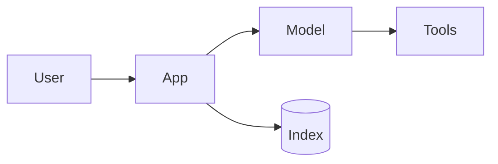

# AI Design — <feature name>

| | |
|---|---|
| Status | <Draft / Agreed> |
| Owner | <who decides> |
| Date | <date>; provider facts (models, limits, prices) checked on <date> |

## 1. Problem and Users

<What task, for whom, why AI (and why not a deterministic solution). Inputs and outputs.>

## 2. Success Criteria

| ID | Criterion | Measured by | Target |
|---|---|---|---|
| AC-001 | <observable behavior, e.g. "Answers policy questions only from the policy documents, citing them"> | <eval grader / human review / product metric> | <e.g. ≥ 95% pass on the eval, 0 must-pass failures> |

Cost of a wrong output: <annoyance / money / safety / legal>. Human review needed: <yes/no, where>.

## 3. Approach

Chosen rung on the ladder: <single call / structured output / workflow / RAG / agent / fine-tune>.

Why not a lower rung: <evidence: prototype results, eval gap>.

<Components, data flow, workflow steps or agent loop, tools and their permissions.>

## 4. Models

| Role | Model (config key) | Why | Checked on |
|---|---|---|---|
| <main> | <provider / model name> | <eval result, constraints met> | <date> |
| <judge / fallback> | <…> | <…> | <…> |

Constraints considered: modalities, context window, structured output and tool support, languages, data retention and residency, licence (open weights), deployment.

## 5. Context Design

<System prompt outline, retrieved content (how many chunks, which metadata), tools per task, memory, caching layout (stable prefix → volatile suffix).>

## 6. Budgets

| | Estimate | Limit |
|---|---|---|
| Calls per task | <n> | <max steps> |
| Tokens per task (in / out) | <…> | <…> |
| Cost per task | <…> | <budget, alert threshold> |
| Latency | <p50 / p95> | <SLO> |
| Volume | <requests per day / peak per minute> | <rate limits> |

## 7. Data, Privacy, and Compliance

<Data classes sent to the model, minimization and redaction, provider terms (retention, training use, residency), permission enforcement in retrieval and tools, regulatory duties (e.g. AI-interaction disclosure), logging and retention.>

## 8. Risks and Safety

| Risk (OWASP ID) | Scenario | Control |
|---|---|---|
| <LLM01 Prompt Injection> | <retrieved email instructs the agent to forward data> | <plan-then-execute; outbound allow-list; approval for sending> |

Lethal trifecta check: <which of private data / untrusted content / external channel are present, and how they are separated or gated>.

## 9. Failure Handling

<Refusals, truncation, invalid output, timeouts, rate limits, outages, fallbacks, graceful degradation, cost caps.>

## 10. Evaluation Plan

<Dataset sources and size, tags, graders (code, judge, human), must-pass cases, repetitions, baseline, CI gate. See EVAL_REPORT.md.>

## 11. Rollout and Operations

<Shadow / canary / A-B plan, tracing and dashboards, owners, runbook, model deprecation plan.>

## 12. Open Questions

| # | Question | Impact | Owner | Status |
|---|---|---|---|---|
| 1 | <question> | <high / medium / low> | <who> | <open / resolved> |
