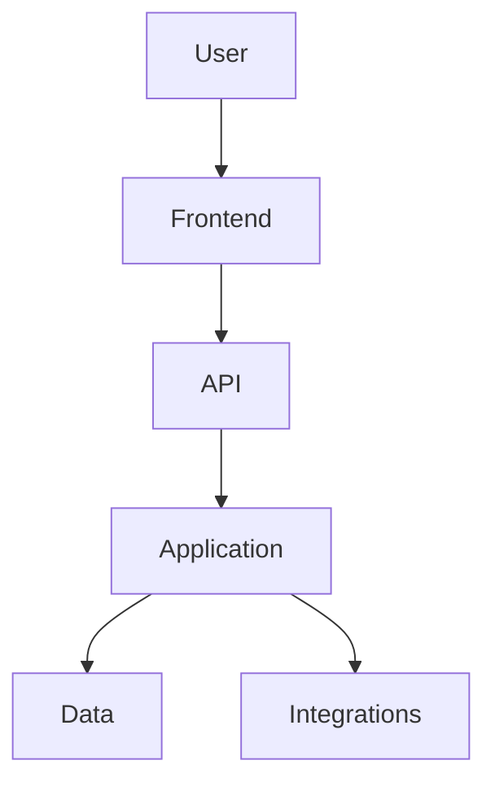

# PROJECT_GUIDE.md

> Current-state map for humans and AI coding agents. Keep this document synchronized with repository reality.

## 1. Executive Summary & Tech Stack Map

### Application Purpose

### Stack Map
| Area / Sub-project | Location | Language / Runtime | Framework | Build Tooling | Key Libraries |
|---|---|---|---|---|---|
| e.g. Backend API | `src/Api` | | | | |
| e.g. Web frontend | `web/` | | | | |

### Persistence

### External Integrations

### Runtime / Deployment Context

## 2. End-to-End Architecture & Layering

## 3. Established Code Style & Existing Patterns

### Naming

### Directory Structure

### Backend Patterns

### Frontend Patterns

### Data Access

### Validation

### Error Handling

### Async Behavior

### Testing

## 4. Application Flow & Business Capabilities

### Major Capabilities

### Important User Journeys

### Business Flows

### State Transitions

### Important Business Rules

## 5. Comprehensive Mechanized Inventories

> One inventory per stack or sub-project, using the categories that fit that stack (web backend, web frontend, mobile, desktop, data/ML, infrastructure, library/CLI, systems/embedded, game).
> Areas not inspected in depth:

### Project Map (monorepos / multi-repo)
| Path or Repository | Stack | Role | Inspected in depth? |
|---|---|---|---|

### Inventory — [Sub-project] ([stack])
- [Category]:

<!-- Example for a web backend:
- Controllers / Endpoints:
- Services / Use Cases:
- Repositories / Data Access:
- Entities / Domain Models:
- DTOs / Schemas:
- Validators:
- Middleware / Filters:
- Authentication / Authorization:
- Background Jobs / Consumers:
- Integrations:
- Configuration keys (names only):
-->

<!-- Example for a web frontend:
- Pages / Views / Routes:
- Components:
- State / Stores:
- API clients:
- Models / Types:
- Shared utilities:
- Build / deployment scripts:
-->

## 6. AI Assistant & Developer Contribution Rules

### Architecture Boundaries

### Dependency Direction

### Reusable Components

### Sensitive Areas

### Files Requiring Extra Care

### Build Commands

### Test Commands

### Test Baseline
- Last known full-suite result (command, passed / failed / skipped, date or commit):
- Known pre-existing failures:
- Known flaky tests (with tracking notes):
- CI pipeline and the test command it runs:
- Honest Green: never delete, skip, or weaken tests to get a passing result.

### Verification Requirements

### Git & Commit Rules
- Commits are authored by the human developer only. Do not add AI agents as authors or contributors, and do not add `Co-Authored-By:` trailers or "Generated with …" lines for AI tools.
- Do not commit, push, or open pull requests unless explicitly asked.
- `.gitignore` location(s):
- Never commit: `.env` / local secret files, build output, dependency folders.
- Tracked files that should be ignored (report only, do not rewrite history):

## 7. Risk Matrix & Modernization Recommendations

| Area | Current State | Risk | Recommendation | Priority |
|---|---|---|---|---|
| Security | | | | |
| Performance | | | | |
| Reliability | | | | |
| Maintainability | | | | |
| Coupling | | | | |
| Dependencies | | | | |
| Data Access | | | | |
| Interface Contracts | | | | |
| Testing | | | | |

> Never expose credential values. Document configuration key names only.
