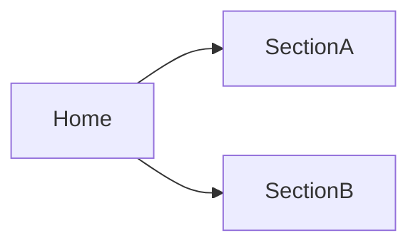
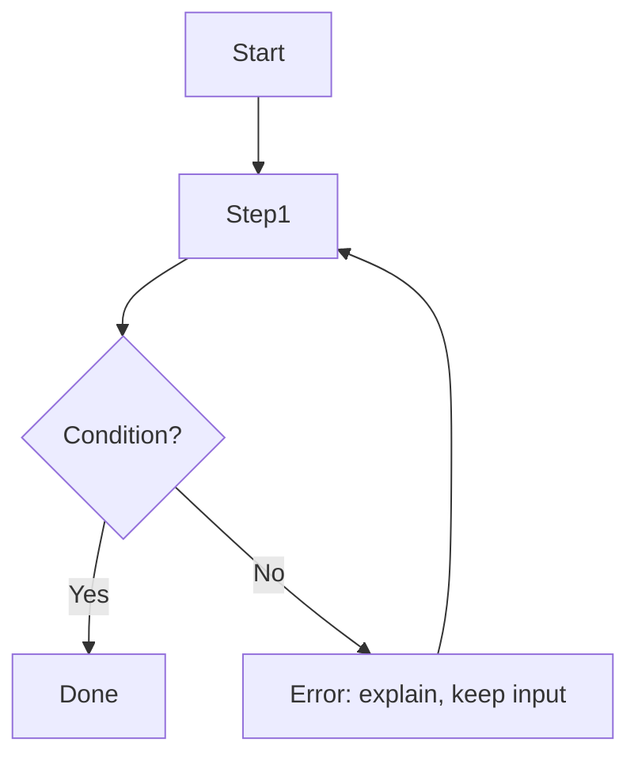

# UX Brief — <product or feature>

| | |
|---|---|
| Status | <Draft / Agreed> |
| Owner | <who decides> |
| Platforms | <web / iOS / Android / desktop / dashboard> |
| Date | <date> |

Evidence labels: **[O]** observed (research, analytics), **[R]** reported (stakeholders, users), **[A]** assumption.

## 1. Problem

<What problem, for whom, and why it matters now. What people do today instead.>

## 2. Users and Context

| User | Jobs to be done | Context of use | Expertise | Evidence |
|---|---|---|---|---|
| <primary user> | When <situation>, I want to <motivation>, so I can <outcome> | <device, environment, frequency, constraints> | <novice / expert> | <[O] / [R] / [A]> |

Proto-personas (if used, labelled as proto-personas): <short profiles>.

Inclusion: <permanent, temporary, and situational limitations to design for; languages and locales>.

## 3. Goals and Success Metrics

| Goal | Metric | Target | How measured |
|---|---|---|---|
| <user or business goal> | <task success, time on task, conversion, SUS, …> | <value> | <analytics, test, survey> |

## 4. Scope

- **In scope:** <flows, platforms>
- **Out of scope:** <explicitly excluded>
- **Constraints:** <design system, brand, tech stack, platform guidelines, accessibility level (WCAG 2.2 AA minimum), legal, deadlines>

## 5. Journey

<Journey map summary or table: stages → actions → touchpoints → pain points → opportunities.>

## 6. Information Architecture

Navigation model per platform: <top nav, sidebar, tab bar, rail, drawer, menus>.

## 7. User Flows

### <Flow name>

Critical path: <n> steps. Unhappy paths covered: <errors, empty, permissions, offline, cancel>.

## 8. UX Requirements

| ID | Requirement | Rationale | Priority |
|---|---|---|---|
| UX-001 | <observable requirement, e.g. "A returning user can reorder a past order in two taps from the home screen"> | <why> | <Must / Should / Could> |

## 9. Content

<Key terminology (glossary), tone, content sources, localization needs, longest realistic values.>

## 10. Open Questions and Assumptions

| # | Question or assumption | Impact if wrong | How to resolve | Status |
|---|---|---|---|---|
| 1 | <question> | <high / medium / low> | <research, stakeholder, data> | <open / resolved / accepted> |

## 11. Research Plan (if needed)

<Method, participants, tasks as scenarios, success criteria, timeline.>
