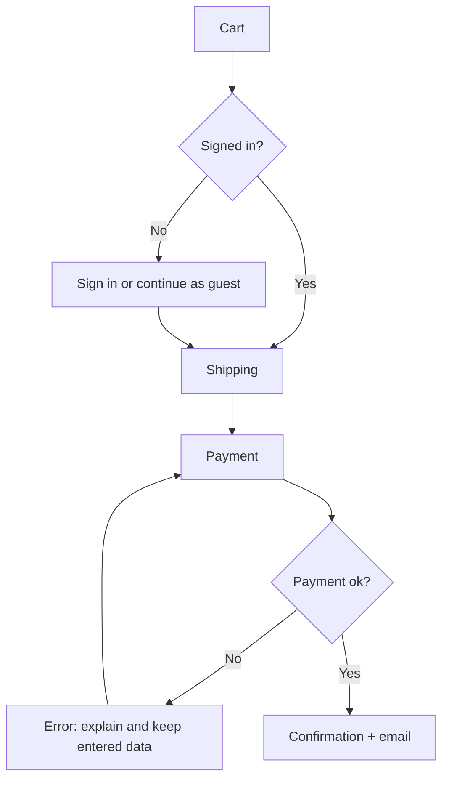

# UX Discovery and Definition

How to understand the problem, the people, and the structure before designing screens (Mode A). The output is `UX_BRIEF.md` (from `references/UX_BRIEF.template.md`).

## Contents

1. Discovery questions
2. Evidence levels
3. Users: jobs, personas, context
4. Journeys and flows
5. Information architecture
6. Success metrics
7. Research planning
8. Definition of done for discovery

---

## 1. Discovery questions

Ask in rounds of three to five, highest impact first. Skip anything the conversation, the repository, existing docs, or the live product already answers.

| Area | Questions |
|---|---|
| Problem | What problem are we solving, for whom, and how do we know it is a problem? What happens today instead (workarounds, competitors, spreadsheets)? |
| Users | Who are the primary and secondary users? How expert are they, how often do they use it, and on what devices? |
| Context of use | Where and when is it used (office, on the move, one-handed, noisy, bright sunlight, low bandwidth)? Any assistive technology users? |
| Goals | What must a user accomplish (top three tasks)? What does the business need (conversion, retention, fewer support tickets)? |
| Scope | Which flows and platforms are in scope now? What is explicitly out? |
| Constraints | Existing design system or brand, tech stack, platform guidelines, deadlines, legal or accessibility obligations, languages and locales |
| Content and data | What content exists, who writes it, and how long can it get? What data is shown, and how much of it? |
| Evidence | Existing research, analytics, support tickets, reviews, or usability findings? |
| Success | How will we know the design works (metrics, qualitative signals)? |

## 2. Evidence levels

Always say which level a statement rests on:

| Level | Examples | How to label it |
|---|---|---|
| Observed | Usability tests, interviews, field studies, analytics, support logs | "Observed in …" with the source |
| Reported | Stakeholder or user statements, surveys | "Reported by …" |
| Assumed | Your reasoning, heuristics, analogies | "Assumption:" and add it to the open questions |

Never invent research: no fabricated quotes, statistics, interview findings, or "users told us". Personas without research are **proto-personas** and must be labelled that way.

## 3. Users: jobs, personas, context

* **Jobs to be done:** "When [situation], I want to [motivation], so I can [expected outcome]." Jobs are stable and technology-free; they keep the design focused on outcomes rather than features.
* **Proto-personas** (only when useful): name, role, goals, frustrations, context, skill level, and devices. One or two are enough; more than three dilutes decisions.
* **Accessibility and inclusion:** include users with permanent, temporary, and situational limitations (low vision, one hand busy, bright sun, cognitive load, slow network, older devices, other languages).
* **Expertise spectrum:** novice versus expert changes density, shortcuts, onboarding, and defaults.

## 4. Journeys and flows

* **Journey map:** stages → user actions → touchpoints → thoughts and feelings → pain points → opportunities. Use it when the experience spans channels or time (sign-up to first value, order to delivery).
* **User flow:** the path through screens for one task, including decisions, errors, and exits. Write it in Mermaid so it lives in the repository:

* Every flow shows the **unhappy paths**: validation errors, empty results, permission denied, timeouts, offline, and cancellation.
* Mark the **critical path** (the minimum steps to value) and count its steps; fewer steps and decisions usually means a better flow.

## 5. Information architecture

* **Content inventory:** list what exists (pages, objects, actions) before organizing it.
* **Organize by user mental model**, not org chart or database tables. Validate with card sorting (open, to discover groups; closed, to test them) and tree testing (can people find X in this structure?).
* **Navigation model per platform:** top nav or sidebar (web), tab bar (iOS), navigation bar, rail, or drawer by window size (Android), menus plus sidebar (desktop).
* **Naming:** use the users' words (from support tickets, search logs, interviews), be consistent, and avoid internal jargon.
* **Sitemap** in Mermaid (`flowchart LR` or `mindmap`) with depth kept shallow; three levels is a practical limit for most products.

## 6. Success metrics

| Framework | Use for |
|---|---|
| Task success rate, time on task, error rate | Usability of specific tasks |
| HEART (Happiness, Engagement, Adoption, Retention, Task success) with goals, signals, and metrics | Product-level UX goals |
| SUS (System Usability Scale) or SEQ (Single Ease Question) | Standardized satisfaction benchmarks |
| Business outcomes (conversion, activation, support contacts) | Linking UX to value |

Define metrics before designing, so success is not judged by opinion afterwards.

## 7. Research planning

Claude cannot run research with real people, but it can plan it well and analyze results the user brings back.

| Question | Method |
|---|---|
| What do users need and why? | Interviews (5–8 per segment), contextual inquiry |
| Can people use this design? | Moderated usability test: about 5 participants per round finds most major issues; iterate and test again |
| Which option performs better at scale? | A/B test (needs traffic and a single clear metric) |
| How do people group or find things? | Card sorting, tree testing |
| What is happening in the product? | Analytics funnels, session recordings (with consent), support-ticket analysis |
| How satisfied are users? | SUS, SEQ, NPS (NPS is weak for UX decisions) |

A usability test plan contains: goals, participants and recruiting criteria, tasks written as scenarios (not instructions: "You want to return the shoes you bought", not "Click Returns"), success criteria per task, the script (intro, consent, think-aloud, tasks, debrief), and what will be measured. Never lead the participant.

## 8. Definition of done for discovery

* The problem, users, top tasks, context of use, constraints, and success metrics are written down.
* Each important statement is marked observed, reported, or assumed.
* Main flows exist in Mermaid, including unhappy paths.
* The IA or navigation model is proposed for the in-scope platforms.
* UX requirements carry identifiers (`UX-001`) so designs and tests can trace to them.
* Open questions are listed with their impact, and critical ones are resolved or explicitly accepted by the user.
